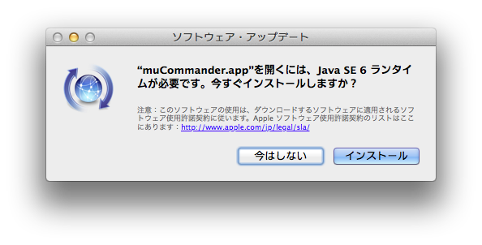

# Mac: Maverick

* java runtime がなくなっていた
  ```
  java
  No Java runtime present, requesting install.
  ```
  muCommander を起動しようとすると、次のメッセージダイアログが表示された。  
  
* 「インストール」をクリックすると、Java 1.6.0_65 がインストールされる。  
  ```
  java -version
  java version "1.6.0_65"
  Java(TM) SE Runtime Environment (build 1.6.0_65-b14-462-11M4609)
  Java HotSpot(TM) 64-Bit Server VM (build 20.65-b04-462, mixed mode)
  ```
* ant もなくなっていた  
  次のコマンドでインストールされるという情報がありましたが、404 not found でインストールできず。  
  `brew install https://raw.github.com/Homebrew/homebrew-dupes/master/ant.rb`


時々 command + tab でのアプリ切替えができなくなる


メールと通知の連動がうまくいかない時がある  
* 既読のメールが通知センターに表示されている
* 未読のメールが通知センターに表示されていない

* Xcode 4.6.3 でビルドすると、次のエラーが発生  
`ibtoold(5023,0x106493000) malloc: *** auto malloc[5023]: error: GC operation on unregistered thread. Thread registered implicitly. Break on auto_zone_thread_registration_error() to debug.Command /Applications/Xcode463.app/Contents/Developer/usr/bin/ibtool emitted errors but did not return a nonzero exit code to indicate failure`  
回避策 … なし
